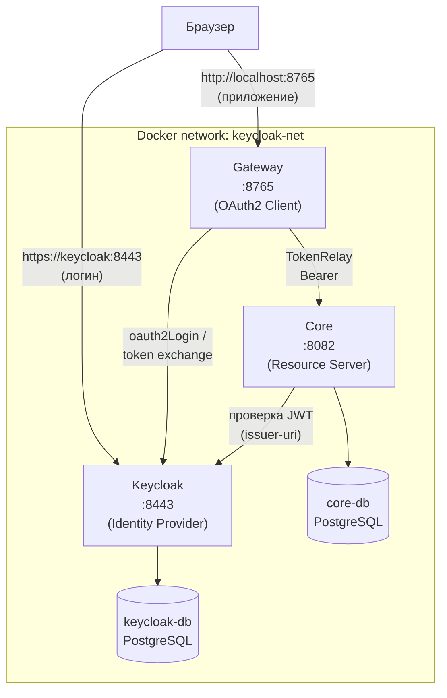

# Настройка dev-окружения: Keycloak + Gateway + Core

Инструкция по локальному развёртыванию связки Keycloak (IDP), Gateway (Spring Cloud Gateway, OAuth2 Client) и Core (Spring Boot, OAuth2 Resource Server) через Docker Compose.

## Архитектура



- **Gateway** — единая точка входа для браузера. Аутентифицирует пользователя через Keycloak (`oauth2Login`), пробрасывает access token в `core` через `TokenRelay`.
- **Core** — Resource Server, проверяет JWT от Keycloak.
- **Keycloak** — issuer токенов, отдельный realm `DACS` с клиентом `gateway`.

---

## 1. Предварительные требования

- Docker Desktop (с включённым WSL2-бэкендом, если Windows)
- [mkcert](https://github.com/FiloSottile/mkcert) — для локальных доверенных TLS-сертификатов
  ```powershell
  choco install mkcert
  ```
- Java 25 и Maven — если планируете собирать/запускать `gateway`/`core` вне Docker

---

## 2. Настройка hosts-файла (Windows)

Добавьте в `C:\Windows\System32\drivers\etc\hosts` (редактировать от имени администратора):

```
127.0.0.1   keycloak
```

Это нужно, чтобы браузер на хосте резолвил `keycloak` в тот же контейнер, что и внутренние сервисы внутри Docker-сети — единый hostname для front-channel и back-channel.

---

## 3. Генерация TLS-сертификата

```powershell
mkcert -install
mkdir infra\keycloak\certs
cd infra\keycloak\certs
mkcert -cert-file cert.pem -key-file key.pem keycloak 127.0.0.1 ::1
```

Полученный `cert.pem` / `key.pem` **не коммитятся**.

### Доверие сертификату внутри Java-контейнеров

JVM внутри Docker-образов gateway/core не знает про CA от mkcert. Экспортируйте корневой сертификат:

```powershell
mkcert -CAROOT
```

Скопируйте `rootCA.pem` из этой папки в `gateway/rootCA.pem` и `core/rootCA.pem` (тоже не коммитить — свой CA у каждого разработчика).

---

## 4. Realm-конфигурация Keycloak

Файл `infra/keycloak/import/realm-dev.json` — импортируется автоматически при старте (`--import-realm`), **только если realm ещё не существует** в БД. Чтобы переимпортировать после правок — снести volume: `docker compose down -v`.

---

## 5. Запуск

```powershell
cd infra
docker compose -f docker-compose.dev.yml up -d --build
```

---

## Известные особенности / гочи

- **`--import-realm` импортирует realm только один раз.** Правки в `realm-dev.json` не подхватятся при повторном `up`, если realm уже есть в БД — нужно `docker compose down -v`, чтобы снести volume с БД Keycloak.
- **Postgres 18 меняет точку монтирования volume** — `/var/lib/postgresql`, а не `/var/lib/postgresql/data`, как в более старых версиях образа.
- **`uri` в маршруте Gateway** учитывает только `scheme://host:port` — путь, если он там написан, игнорируется; реальный путь берётся из входящего запроса и модифицируется фильтрами (`StripPrefix`, `RewritePath` и т.п.).
- **`@RestController`-эндпоинты перехватывают запросы раньше маршрутизации Gateway** — если путь совпадает и с локальным контроллером, и с маршрутом Gateway, выигрывает контроллер.
- **`GlobalFilter` не применяется к запросам, обработанным напрямую контроллером** — только к тем, что реально прошли через `Route`. Если нужен фильтр для всех запросов без исключения — использовать `WebFilter`, а не `GlobalFilter`.
- **`spring-boot-starter-web` и `spring-boot-starter-webflux`/Gateway несовместимы в одном модуле** — Spring Boot может собрать сервлетный контекст вместо реактивного, из-за чего вся маршрутизация Gateway перестаёт работать (симптом: `Tomcat` в логе вместо `Netty`, классическая Whitelabel Error Page вместо JSON-ошибок).
- **JVM внутри контейнера не доверяет самоподписанным сертификатам от mkcert по умолчанию** — нужно вручную импортировать `rootCA.pem` в `cacerts` образа (см. раздел 3).